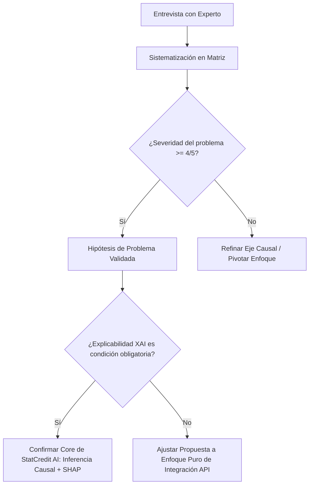

# Tarea 1: Taller de Ideación – Validación del Problema con Expertos (PE2)
**Proyecto:** StatCredit AI – API de Inferencia Causal & XAI para Scoring Crediticio Alternativo  
**Curso:** Emprendimiento (Pregrado en Ciencia de Datos - Universidad Externado de Colombia)  
**Fecha:** Septiembre 2026  

---

## 1. Objetivo del Taller de Ideación y Validación
El objetivo de este taller es someter las hipótesis fundamentales del problema reencuadrado de **StatCredit AI** al juicio de expertos clave en el ecosistema financiero, crediticio y regulatorio colombiano. Buscamos validar o falsar la existencia y severidad de las 4 causas raíz identificadas (Datos, Algoritmos, Cultura y Regulación), asegurando que el problema sea lo suficientemente doloroso y de alto valor como para justificar una solución basada en Inteligencia Artificial Explicable e Inferencia Causal.

---

## 2. Definición del Perfil de los Expertos A Consultar

Para obtener validaciones de alto impacto, el taller de ideación se estructurará con 3 arquetipos de expertos del sector crediticio colombiano:

| Arquetipo de Experto | Rol / Cargo Típico | Enfoque de Validación |
| :--- | :--- | :--- |
| **Experto 1: Gestión de Riesgo (Banca/Fintech)** | Chief Risk Officer (CRO) / Director de Originación y Riesgo Crediticio | Validar la viabilidad de incorporar scoring alternativo en comités de crédito y la frustración con rechazos masivos de independientes. |
| **Experto 2: Ciencia de Datos & Open Finance** | Lead Data Scientist / ML Architect en Buró o Fintech | Validar las limitaciones metodológicas de las regresiones logísticas tradicionales y la necesidad de explicabilidad (SHAP/Inferencia Causal). |
| **Experto 3: Cumplimiento & Regulación SARC** | Consultor Normativo / Auditor de Riesgo SARC (Superfinanciera / Supersolidaria) | Validar la barrera de adopción regulatoria, la auditabilidad algorítmica y los requisitos de la Circular 026/SARC. |

---

## 3. Reencuadre del Problema a Someter a Validación

> **Problema Tradicional:** «Los trabajadores independientes y micronegocios no tienen historial crediticio formal en centrales de riesgo (DataCrédito/TransUnion) y, por lo tanto, representan un alto riesgo de morosidad para el sistema bancario.»
> 
> **Reencuadre StatCredit AI:** «Los trabajadores independientes sí poseen una intensa actividad financiera y transaccional diaria (billeteras digitales, facturación electrónica, transferencias), pero esta información se encuentra fragmentada y los modelos lineales tradicionales carecen de la capacidad metodológica para interpretarla como un activo de repago.»
> 
> **Mantra / Enunciado Insignia:** *“No buscamos cambiar quién puede acceder al crédito; buscamos cambiar la forma en que se mide quién puede pagarlo.”*

---

## 4. Guía Estructurada de Entrevista Cualitativa para Expertos

### Bloque A: Validación de la Infraestructura de Datos (Causa 1)
1. *¿Qué porcentaje estimado de solicitudes de crédito de independientes o micronegocios terminan siendo rechazadas en su entidad debido a la falta de consulta exitosa en DataCrédito/TransUnion?*
2. *¿Su entidad utiliza actualmente datos transaccionales no bancarios (extractos de Nequi/Daviplata, facturación DIAN)? ¿Cuáles son los principales obstáculos técnicos para procesar estos datos a escala?*

### Bloque B: Validación Metodológica y Algorítmica (Causa 2)
3. *Los modelos actuales de score se basan predominantemente en regresiones logísticas sobre datos históricos. ¿Ha detectado falsos negativos altos (clientes independientes capaces de pagar pero rechazados por el modelo)?*
4. *Si un modelo predictivo basado en Gradient Boosting o Inferencia Causal aumentara la precisión de aprobación en un 25%, pero operara como una caja negra, ¿su comité de riesgo lo aceptaría para originación?*

### Bloque C: Validación Cultural y Sesgos institucionales (Causa 3)
5. *Existe el sesgo institucional de que "el asalariado formal es seguro y el independiente es inseguro". En la práctica de mora real, ¿los independientes con flujo transaccional constante han mostrado un comportamiento de repago comparable al formal?*
6. *¿Cómo reacciona un analista u oficial de crédito cuando debe justificar la aprobación o rechazo de un crédito a un independiente sin desprendible de nómina?*

### Bloque D: Validación Regulatoria y SARC (Causa 4)
7. *¿Qué exigencias concretas impone la Superintendencia / SARC sobre la explicabilidad de los modelos de scoring en decisiones automatizadas de originación?*
8. *¿Qué nivel de detalle requiere un informe de explicabilidad (ej. gráficos de impacto de variables SHAP o contrafactuales causales) para superar un comité de auditoría de riesgo?*

---

## 5. Matriz de Sistematización de Feedback y Criterios de Pivotaje

Para procesar la información recolectada en el taller de ideación con expertos, se utilizará el siguiente marco de calificación y toma de decisiones:

### Tabla de Captura de Evidencia Cualitativa

| Dimensión Causal | Hipótesis Evaluada | Indicador de Validación (Métrica) | Criterio de Pivotaje / Ajuste |
| :--- | :--- | :--- | :--- |
| **Datos** | La ingesta manual de extractos de billeteras digitales genera fricción inaceptable en originación. | > 80% de los CROs confirman que la fricción manual destruye la conversión. | Si la fricción no preocupa, cambiar enfoque B2B API a herramienta manual para analistas. |
| **Algoritmos** | Las regresiones tradicionales no logran medir variables estacionales de ingresos de independientes. | > 70% de los Data Scientists reconocen alta tasa de falsos negativos en independientes. | Confirmado: Enfatizar algoritmos no lineales con inferencia causal. |
| **Cultura** | Los comités de riesgo prefieren rechazar a independientes por falta de soportes tradicionales. | > 85% de los expertos confirman aversión al riesgo por sesgo en soportes no convencionales. | Validado: El score debe ser intuitivo y estar respaldado por métricas de confianza. |
| **Regulación** | Los modelos de IA no explicables no superan auditorías SARC. | 100% de los auditores exigen explicabilidad local y justificación de variables de decisión. | Confirmado: Mapear la explicabilidad SHAP como requisito reglamentario indispensable. |

---

## 6. Conclusiones Esperadas del Taller de Ideación
1. Confirmación de que el segmento de independientes representa un **océano azul desatendido** por los buros tradicionales.
2. Validación de que la **explicabilidad algorítmica** no es un atributo cosmético, sino una **barrera de entrada regulatoria (SARC)** y un facilitador cultural para la adopción en comités de riesgo.
3. Definición clara de los requerimientos para el desarrollo de la **matriz de experimentos (Tarea 2)** y el **Lienzo Canvas (Tarea 3)**.
